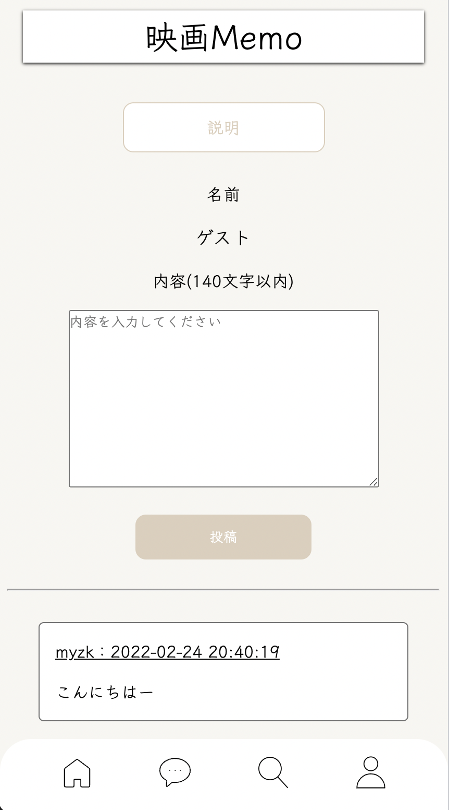
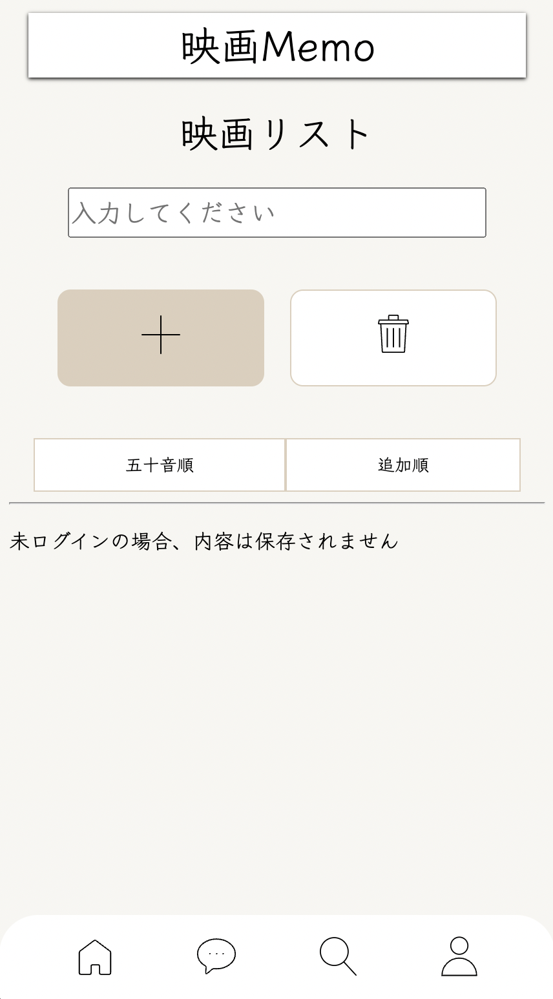

# 映画Memoについて

### [1.作成物](#作成物)
### [2.開発環境](#開発環境)
### [3.画面ごとの機能説明](#画面ごとの機能説明)
### [4.工夫した箇所](#工夫した箇所)
### [5.苦労した箇所](#苦労した箇所)
### [6.進行状況](#進行状況)
### [7.今回の作成を通して学んだ内容](#今回の作成を通して学んだ内容)
### [8.今後作成したい物](#今後作成したい物)
### [9.学びたい内容](#学びたい内容)

## 作成物
今回**映画メモ**というWEBアプリケーションを作成しました。

イメージとしては、メモ帳に掲示板がついている感じになります。

[映画Memo](http://aso2001378.boo.jp/Movie_memo/login/login.php)

[画面設計書](https://overflow.io/s/GHX3NZVV)

## 開発環境

- HTML5
- CSS3
- PHP
- TMDb
- VSCode
- MySQL
- LOLIPOPサーバー

## 画面ごとの機能説明

**新規登録ページ**
- データベースに接続
- PHP & requiredで空白判定
- パスワード一致チェック
- メールアドレス重複チェック
- データベースに入力内容を登録
- ユーザー情報をセッションに保持

**ログインページ**
- データベースに接続
- requiredで空白判定
- データベースに入力内容を参照

**トップページ**
- データベースに接続
- PHP & requiredで空白判定
- データベースに内容を参照
- データベースに入力内容を追加
- データベースの内容を消去

**コメントページ**
- データベースに接続
- PHP & requiredで空白判定
- データベースに内容を参照
- データベースに入力内容を追加
- ユーザー名にセッション内のユーザー情報を表示

**検索ページ**
- TMDb APIを使用
- 入力内容をURLから取得して表示する

**マイページ**
- データベースに接続
- PHP & requiredで空白判定
- データベースに内容を参照
- データベースの内容を更新
- ログアウト(セッション破棄)

## 工夫した箇所
1つ目は画面レイアウトです。今回はスマートフォンメインで作成したので余白やレスポンシブした際のpx数など工夫しました。

2つ目は画面設計図です。誰か見てもわかる資料の作成に工夫しました。今回は私がコーディングの作業も行いましたがプログラム部分と処理内容を分けて書くように工夫しました。分けて書くことにより、ITの知識がない方でも理解できる。コーディングを行う方も理解しやすいといった利点があげられます。

## 苦労した箇所
1つ目はデータベースの記述です。どういった条件式を記入すると望んだ結果になるのかなど試行錯誤しました。考えても分からなかったのでテラテイルという質問サイトで質問してみたところ、一から丁寧に教えていただき、具体的にはcheckboxに入っているものだけデータベースから消去したいと質問したところ、checkboxに値が入っているか確認しPHP記述やDBは後回しの方が良い。まずDB側で操作し条件式などを明確にそらから組み合わせていく。ということを学び、以下の2つを組み合わせることにより完成させることができました。

2つ目はCSSの記述です。CSSは少し苦手でしたので苦労しました。pxを変えるとレイアウトが崩れてしまい、中々画面設計書のレイアウト通りになりませんでした。1つひとつのことを調べていく内に、時間はかかりましたが完成させることができました。

## 進行状況
今回のwebアプリ開発は個人開発でしたが、部分的なアジャイル開発をイメージしながら作成しました。

具体的な完成までの流れをお話しします。

1. 内容決め
1. レイアウト決め
1. 使用機能決め
1. 画面設計書作成
1. 機能の実装&レイアウトや機能の追加
1. テスト
1. 画面設計書最終確認&修正
1. 終了

**内容決め**

今回は映画に関するwebアプリケーションを作成しました。作成しようと思ったきっかけとしましては、私自身映画が好きなので好きな映画を共有しあえてその場でメモを取れるようなものがあったら良いなと思ったという理由です。違うアプリにメモをすると探すのにも時間が取られてしまい面倒になると思いました。

**レイアウト決め**

始めにターゲットを決めました。今回は映画好きの人たちをターゲットにしたのでどういった機能やレイアウトを好むかと自分なりに試行錯誤しました。そこで私は機能で言うと、検索機能を用いれば気になる作品の続編など見つけることが出来るのではないのか。レイアウトで言うと、よく使われるボタンは色で目立たせるようにしたり掲示板など見る際目を疲れさせないように落ち着いた色を使用したりしました。

**使用機能決め**

レイアウトを元にどのページでどんな機能を使用するのか決めました。データベース面で言うと、始めにキーの作成から行いました。書き込み１件ごとに１つの主キーを付けることを意識しながら作成しました。
トップページでは内容を表示するのでselect文を使用します。内容=contentsとするとcontentsとlogin_id(セッションに登録されているユーザーID)の2つをDBに登録することでログインユーザーごとに異なった内容を表示させることができました。

**画面設計書の作成**

ここで一旦レイアウトや機能をまとめるために画面設計書を作成しました。工程1つごとに見直し要点などを追記し、照らし合わせながら作成しました。作成する点で意識したことは、誰が見てもわかるような設計書を目指しました。ITに関する知識がない方に対してシステムの構造を理解してもらうことはかなりハードルが高いことだと思いました。なのでプログラム語は使用せず、遷移図やどういったエラーがでるなど箇条書きにして書きました。

**機能の実装&レイアウトや機能の追加**

画面設計を元に機能の実装を行いました。1画面が終了する都度確認をし、設計書に不備がないかなどチェックをしながらコーディング作業を行いました。

**テスト**

実装が完了しましたのでエラーが無いか、エラーが出た際どういった文を出すかなど済み済みまで確認を行いました。

**画面設計書最終確認&修正**

最終的に作成物と整合性が取れているのか確認を行いました。無事設計書通りに完成しましたので良い経験になりました。

## 今回の作成を通して学んだ内容
今回のアプリ開発を通して色々なことを学びました。中でも貴重な経験になった内容を3つお話しします。

1つ目は論理式です。データベースから概要のものを追加したり絞り込む際、論理式を多用しました。論理式に対する理解が甘かったと言うこともありコーディングの際少しつま付きました。今後は論理式についても学びたいと思います。

2つ目はデータベースの知識です。上記と同じでどういった条件式を記入すれば望むものになるのか悩みながら作成しました。条件式の理解も甘かった為苦労しました。基礎から学び直していこうと思いました。

3つ目はエラー文 if,elseです。エラーが出た際の処理などどういった条件だとエラーが出るなど考えました。例をあげますと入力されていなかった場合、入力されていないという文を出力するなどメールアドレスが登録済みの場合、登録できないなどの処理を記入するなど工夫しました。

## 今後作成したい物
今後は自分の趣味に直結するものを作成しゆくゆくは　私が好きなWEBサイト開発や興味のあるECサイトの開発に携わりたいと思います。

## 学びたい内容
今後学びたいものは色々ありますが、今回は3つお話しします。

1つ目は、rubyやjavascriptなどの言語を中心に今勉強しているPHPも理解を深くしていきたいです。私自身web開発が好きなので自分の中の引き出しを増やせるよう勤しみたいと思います。

2つ目は、画面設計で修正日とその内容も記述すると言うことです。今回は抜けてしまっていた為昨日の自分はどんな修正をしてのか忘れてしまうこともありました。誰が見ても理解しやすい資料に必須だと身を持って体験しました。

3つ目は、classやnameっを付ける際の英語知識です。今まで人ににコードを見てもらうという経験が少なく、英語表記が独特な癖があるので調べながら暗記していきたい思います。
