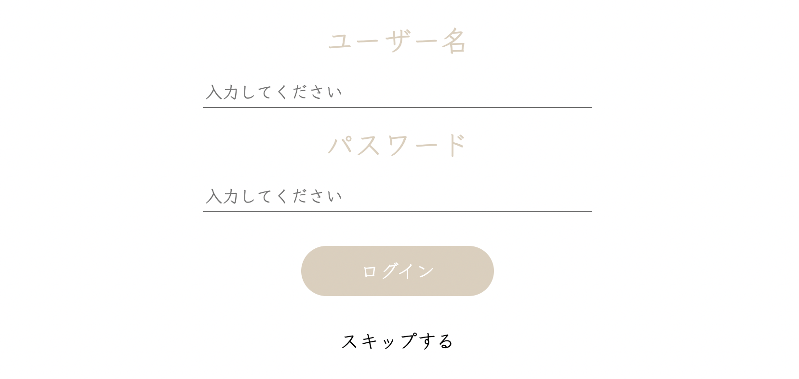
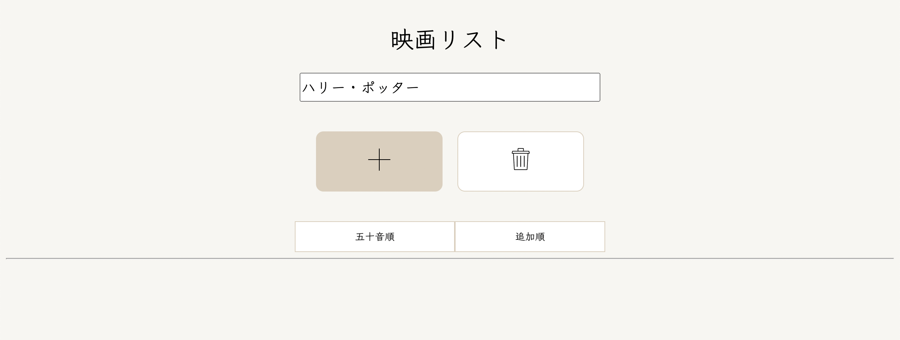
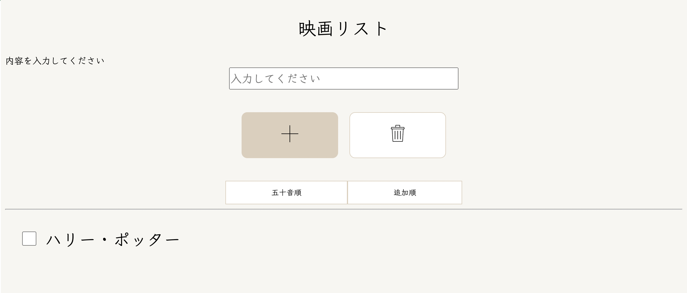
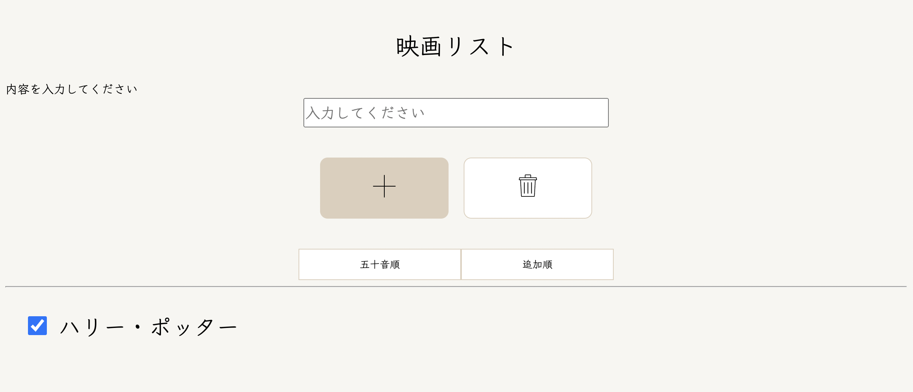

# 映画Memoについて

### [1.作成物](#作成物)
### [2.開発環境](#開発環境)
### [3.画面ごとの機能説明](#画面ごとの機能説明)
### [4.機能説明](#機能説明)
### [5.進行状況](#進行状況)
 

## 作成物
今回**映画メモ**というモバイル向けWEBアプリケーションを作成しました。

イメージとしては、メモ帳に掲示板がついている感じになります。

[映画Memo](http://aso2001378.boo.jp/Movie_memo/login/login.php)

 

 

[画面設計書](https://overflow.io/s/GHX3NZVV)

 

## 開発環境

- HTML5
- CSS3
- PHP
- TMDb
- MySQL
- AdobeXD
- Overflow
- VSCode
- LOLIPOPサーバー
 

## 画面ごとの機能説明

**新規登録ページ**
- データベースに接続
- PHP & requiredで空欄判定
- パスワード一致チェック
- メールアドレス重複チェック
- データベースに入力内容を登録
- ユーザー情報をセッションに保持

**ログインページ**
- データベースに接続
- requiredで空欄判定
- データベースに入力内容を参照

**トップページ**
- データベースに接続
- PHP & requiredで空欄判定
- データベースに内容を参照
- データベースに入力内容を追加
- データベースの内容を消去

**コメントページ**
- データベースに接続
- PHP & requiredで空欄判定
- データベースに内容を参照
- データベースに入力内容を追加
- ユーザー名にセッション内のユーザー情報を表示

**検索ページ**
- TMDb APIを使用
- 入力内容をURLから取得して表示する
- requiredで空白判定

**マイページ**
- データベースに接続
- PHP & requiredで空欄判定
- データベースに内容を参照
- データベースの内容を更新
- ログアウト(セッション破棄)
 

## 機能説明

### 1. ログイン画面

初回はスキップを押す

 

### 2. 新規登録

マイページ画面から新規登録を行う

 

### 3. 内容の入力

追加したい内容を入力する

 

### 4. 内容の登録

＋ボタンを押すと入力した内容がデータベースに登録されて内容一覧を表示する

 

### 5. チェックを入れる

登録されている内容の横にチェックを入れる

 

### 6. 内容の消去

ゴミ箱ボタンを押すとチェックされている内容だけデータベースから消去される

 

## 進行状況
今回のwebアプリ開発は個人開発でしたが、部分的なアジャイル開発をイメージしながら作成しました。

具体的な完成までの流れをお話しします。

1. 内容決め
1. レイアウト決め
1. 使用機能決め
1. 画面設計書作成
1. 機能の実装&レイアウトや機能の追加
1. テスト
1. 画面設計書最終確認&修正
1. 終了

**内容決め**

今回は映画に関するwebアプリケーションを作成しました。作成しようと思ったきっかけとしましては、私自身映画が好きなので好きな映画を共有しあえてその場でメモを取れるようなものがあったら良いなと思ったという理由です。違うアプリにメモをすると探すのにも時間が取られてしまい面倒になると思いました。

**レイアウト決め**

始めにターゲットを決めました。今回は映画好きの人たちをターゲットにしたのでどういった機能やレイアウトを好むかと自分なりに試行錯誤しました。そこで私は機能で言うと、検索機能を用いれば気になる作品の続編など見つけることが出来るのではないのか。レイアウトで言うと、よく使われるボタンは色で目立たせるようにしたり掲示板など見る際目を疲れさせないように落ち着いた色を使用したりしました。

**使用機能決め**

レイアウトを元にどのページでどんな機能を使用するのか決めました。データベース面で言うと、始めにキーの作成から行いました。書き込み１件ごとに１つの主キーを付けることを意識しながら作成しました。
トップページでは内容を表示するのでselect文を使用します。内容=contentsとするとcontentsとlogin_id(セッションに登録されているユーザーID)の2つをDBに登録することでログインユーザーごとに異なった内容を表示させることができました。

**画面設計書の作成**

ここで一旦レイアウトや機能をまとめるために画面設計書を作成しました。工程1つごとに見直し要点などを追記し、照らし合わせながら作成しました。作成する点で意識したことは、誰が見てもわかるような設計書を目指しました。ITに関する知識がない方に対してシステムの構造を理解してもらうことはかなりハードルが高いことだと思いました。なのでプログラム語は使用せず、遷移図やどういったエラーがでるなど箇条書きにして書きました。

**機能の実装&レイアウトや機能の追加**

画面設計を元に機能の実装を行いました。1画面が終了する都度確認をし、設計書に不備がないかなどチェックをしながらコーディング作業を行いました。

**テスト**

実装が完了しましたのでエラーが無いか、エラーが出た際どういった文を出すかなど済み済みまで確認を行いました。

**画面設計書最終確認&修正**

最終的に作成物と画面設計との矛盾がないか確認を行いました。無事設計書通りに完成しましたので良い経験になりました。

